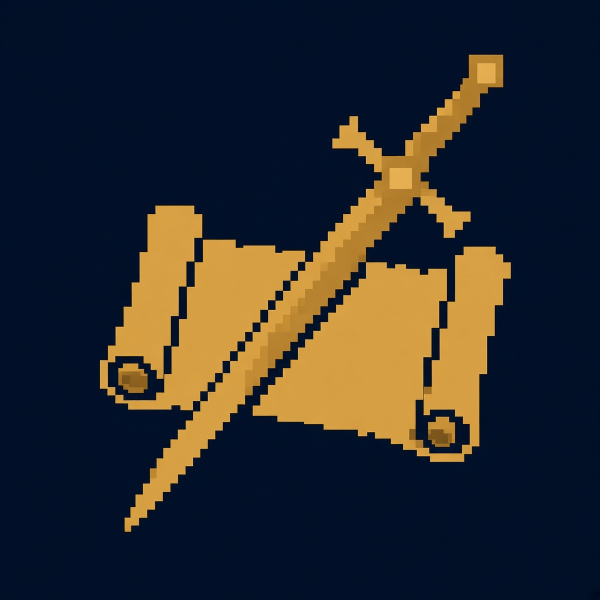
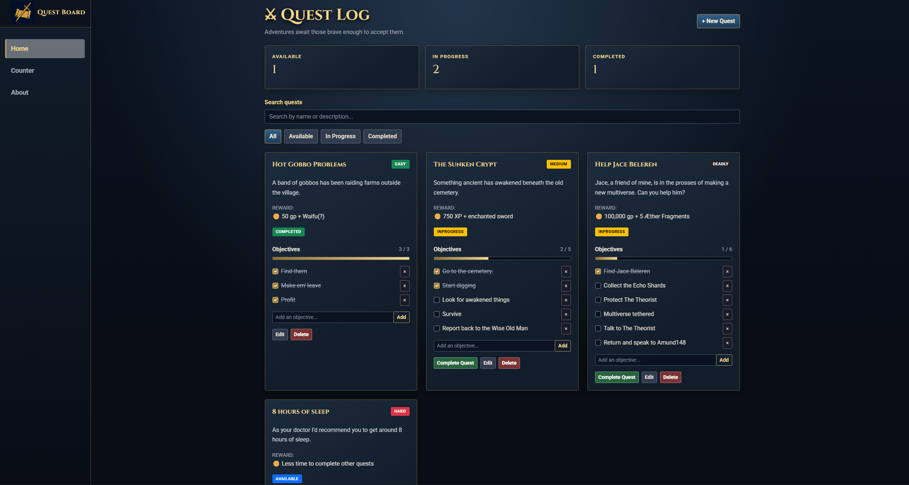

<p align="center">
  
</p>

<h1 align="center" style="color:#f2d58a">Quest Board</h1>

A fantasy-themed quest management web application inspired with a classic RPG quest logs vibe Built as a full-stack learning project.

## Features

- **Quest management** — create, edit, and delete quests.
- **Quest details** — give each quest a name, description, difficulty, reward, and status.
- **Objective tracking** — add and remove objectives, check them off, and track completion progress.
- **Search and filtering** — search quests by name or description and filter by status.
- **Status tracking** — organize quests into Available, In Progress, and Completed.
- **Persistent storage** — save quests locally so they remain available after restarting the application.

## Screenshots

<p align="center">
  
</p>

## Built With

- C#
- ASP.NET Core 10
- Blazor
- Bootstrap
- Blazor.Bootstrap
- JSON file storage

## Getting Started

### Prerequisites

- [.NET 10 SDK](https://dotnet.microsoft.com/download/dotnet/10.0)
- [Git](https://git-scm.com/) (optional, for cloning the repository)

### Installation

1. Clone the repository:

   ```bash
   git clone https://github.com/Brage1025/QuestBoard.git
   ```

2. Navigate to the project directory:

   ```bash
   cd QuestBoard
   ```

3. Restore dependencies:

   ```bash
   dotnet restore
   ```

4. Run the application:

   ```bash
   dotnet run
   ```

5. Open the local URL shown in your terminal.

## Data Storage

Quest data is stored as JSON on the local machine, in the application's local application data directory.

This is a simple persistence approach for a learning project. The data is not shared between different users or devices, and the application does not currently use a database.

## Project Goals

Quest Board is intended to practice and demonstrate:

- Building interactive web applications with Blazor.
- Organizing code into models, reusable components, and services.
- Implementing create, read, update, and delete (CRUD) operations.
- Handling application state and form validation.
- Saving and loading data using JSON.
- Styling a consistent, responsive user interface.
- Using Git and GitHub to manage a software project.

## License

This project is licensed under the [MIT License](LICENSE).

---

<div align="center">

_"To &lt;div&gt; or not to &lt;div&gt;, that is the question."_
— [Brage1025](https://github.com/Brage1025)

</div>
